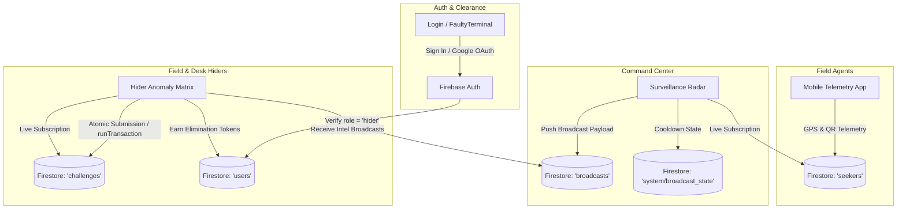

# OpenVerse // Solve & Seek (Hide & Seek Tactical Grid)

[](https://react.dev/)
[](https://www.typescriptlang.org/)
[](https://vitejs.dev/)
[](https://tailwindcss.com/)
[](https://firebase.google.com/)
[](https://leafletjs.com/)
[](LICENSE)

Tactical Campus Surveillance Command Center & Competitive Hider Challenge Matrix built for real-world campus-scale Alternate Reality Gaming (ARG) and Capture The Flag (CTF) at **IIIT Kottayam**.

---

## 🎯 Overview & Concept

**OpenVerse // Solve & Seek** connects mobile field agents (**Seekers**) and stationary operatives (**Hiders & Command Control**) into an integrated real-time tactical grid:

* **Field Seekers** navigate campus zones, hunting for hidden physical QR artifacts and transmitting live GPS telemetry.
* **Command Surveillance** tracks seeker movements on an interactive tactical radar and broadcasts synchronized position intel windows.
* **Hider Operatives** solve competitive technical anomalies across multiple computing domains to earn elimination tokens, lock out rival operatives, and intercept transmission intel to evade detection.

---

## 🚀 Key Features

### 🛰️ Tactical Surveillance Radar (`/surveillance`)
* **Interactive GIS Leaflet Engine**: Real-time positioning calibrated to IIIT Kottayam coordinates (`9.75495, 76.64995`).
* **Official Campus Polygons**: Precise boundary outlines for Academic Block 1 & 2, Admin Block, Open Area Theatre (OAT), Dining Hall, Fitness Centre, and Sports Grounds.
* **Reconnaissance Map Layers**: Toggle between **CartoDB Dark Matter** (high-contrast tactical dark grid) and **Esri World Imagery** (high-resolution satellite reconnaissance).
* **Live Seeker Telemetry**: Real-time status drawer showing battery %, connection quality (`STRONG` | `GOOD` | `WEAK`), speed, ping recency, and scanned QR artifacts (out of 15 campus items).
* **Integrated Simulator**: Built-in test node simulator to dispatch and evaluate seeker telemetry without requiring physical field agents.

### 📡 Periodic Transmission Intel Protocol (`SharePositionsControl`)
* **10-Minute Cooldown Windows**: Monotonically synchronized server clock ensures fair, tamper-proof countdown intervals.
* **Tactical Broadcast Release**: Command operators push real-time snapshots of all active seeker positions directly to field hiders.
* **Historical Transmission Logs**: Inspect past transmission payloads directly from the radar HUD.

### ⚡ Competitive Anomaly Challenge Matrix (`/hider`)
* **Multi-Discipline Puzzle Pool**: Anomaly challenges spanning `CRYPTOGRAPHY`, `NETWORK`, `LOGIC`, `LINUX`, `OSINT`, and `CAMPUS` intelligence.
* **Atomic First-Solve Lockout**: Powered by Cloud Firestore transactions (`runTransaction`). The first operative to submit the verified answer claims points and elimination tokens; subsequent submissions are instantly locked out with the claiming operative's callsign displayed.
* **Cyber Terminal Modal**: High-fidelity terminal modal with syntax hints, auto-focus, whitespace/case normalization, and pipe-delimited multi-answer support.
* **Operative HUD & Filters**: Track your elimination token balance and filter anomalies by `ALL`, `OPEN`, `CLAIMED BY OTHERS`, or `SOLVED BY ME`.

### 🔒 Cyberpunk Authentication & Security (`/login`)
* **WebGL CRT Shader**: GPU-accelerated CRT monitor effect powered by `ogl` (`FaultyTerminal`), reacting dynamically to cursor movement and time distortion.
* **Dual Auth Modes**: Sign in with Email/Password or one-click Google OAuth via Firebase Authentication.
* **Strict Role Clearance**: Only operatives with `role = "hider"` in the database schema are permitted access. Unauthorized accounts are safely signed out and presented with a 403 Security Lockout screen.

---

## 🏗️ Architecture & Data Flow



---

## 💻 Tech Stack

| Layer | Technologies | Role |
| :--- | :--- | :--- |
| **Frontend Framework** | React 19, TypeScript ~6.0, Vite 8 | UI, routing, ultra-fast HMR |
| **State Management** | Zustand 5 | Decoupled stores (`authStore`, `surveillanceStore`, `hiderStore`) |
| **Styling & Motion** | Tailwind CSS 3.4, PostCSS, Framer Motion 13 | Neon cyber aesthetics, spring animations |
| **WebGL & Shaders** | OGL 1.0 | CRT monitor terminal background |
| **Geospatial & Mapping** | Leaflet 1.9, CartoDB Dark Matter, Esri Satellite | GIS radar, zone boundaries, seeker markers |
| **Backend & Realtime** | Firebase Auth, Cloud Firestore (Web SDK v12) | Real-time streams (`onSnapshot`), atomic transactions |
| **Linting & Verification**| Oxlint 1.79, `tsc -b` | Blazing-fast static verification |

---

## 📁 Project Structure

```
hidenseek/
├── public/                       # Static public assets
├── src/
│   ├── assets/                   # Vector graphics and icons
│   ├── components/
│   │   ├── hider/                # Anomaly cards, terminal modal & operative HUD
│   │   │   ├── ChallengeCard.tsx
│   │   │   ├── ChallengeTerminalModal.tsx
│   │   │   └── HiderHUD.tsx
│   │   ├── layout/               # High-level shell, headers & scanline overlays
│   │   │   └── GameLayout.tsx
│   │   ├── surveillance/         # Radar maps, telemetry drawer & transmission controls
│   │   │   ├── SeekerTelemetryDrawer.tsx
│   │   │   ├── SharePositionsControl.tsx
│   │   │   └── SurveillanceMap.tsx
│   │   └── ui/                   # WebGL CRT shader & reusable primitives
│   │       ├── FaultyTerminal.css
│   │       └── FaultyTerminal.tsx
│   ├── lib/                      # Core services & utilities
│   │   ├── firebase.ts           # Firebase SDK initialization & atomic transactions
│   │   ├── gameService.ts        # Store-to-database bridge service
│   │   ├── iiitkCampusData.ts    # OpenStreetMap geographic campus zones
│   │   └── serverTime.ts         # Clock skew synchronization & monotonic time
│   ├── pages/                    # Route views
│   │   ├── Hider.tsx             # Hider Anomaly Grid (/hider)
│   │   ├── Login.tsx             # Cyberpunk Auth Terminal (/login)
│   │   └── Surveillance.tsx      # Command Radar Dashboard (/surveillance, /)
│   ├── store/                    # Zustand modular state stores
│   │   ├── authStore.ts          # Auth state, session cache & profile verification
│   │   ├── hiderStore.ts         # Challenge pool, filters & atomic submission state
│   │   └── surveillanceStore.ts  # Seeker nodes, map selection & broadcast cooldown
│   ├── types/                    # TypeScript interfaces & domain models
│   │   └── game.ts
│   ├── utils/                    # Utility helpers (cn.ts)
│   ├── App.tsx                   # Top-level routing and role clearance guards
│   ├── index.css                 # Global styles, cyber scrollbars & typography
│   └── main.tsx                  # Application entry point
├── .env.example                  # Environment configuration reference
├── package.json                  # Scripts & dependencies
├── tailwind.config.js            # Custom colors, animations & font families
└── vite.config.ts                # Vite build configuration
```

---

## ⚙️ Getting Started

### 1. Prerequisites
* **Node.js**: v18.0.0 or higher
* **npm**, **pnpm**, or **yarn**
* A modern browser with WebGL2 support (Chrome, Firefox, Safari, Edge)

### 2. Clone the Repository
```bash
git clone https://github.com/tovi-govi/solvenseek.git
cd solvenseek
```

### 3. Install Dependencies
```bash
npm install
```

### 4. Configure Environment Variables
Copy `.env.example` to create your local environment file:
```bash
cp .env.example .env.local
```

Populate `.env.local` with your credentials:
```env
# Firebase Configuration
VITE_FIREBASE_API_KEY=your_firebase_api_key_here
VITE_FIREBASE_AUTH_DOMAIN=your_project_id.firebaseapp.com
VITE_FIREBASE_PROJECT_ID=your_project_id
VITE_FIREBASE_STORAGE_BUCKET=your_project_id.firebasestorage.app
VITE_FIREBASE_MESSAGING_SENDER_ID=your_messaging_sender_id
VITE_FIREBASE_APP_ID=your_firebase_app_id
VITE_FIREBASE_MEASUREMENT_ID=your_measurement_id

# Tactical Map Configuration
VITE_CARTO_API_KEY=your_carto_api_key_here
```

> [!NOTE]
> `src/lib/firebase.ts` supports reading these environment variables dynamically, while including safe fallback defaults for quick testing.

### 5. Run Development Server
```bash
npm run dev
```
Open [http://localhost:5173](http://localhost:5173) in your browser.

---

## 📜 Available Scripts

| Command | Action |
| :--- | :--- |
| `npm run dev` | Starts the local Vite development server with Hot Module Replacement (HMR). |
| `npm run build` | Compiles TypeScript declarations (`tsc -b`) and generates production bundles in `dist/`. |
| `npm run test` | Performs strict type assertion (`tsc -b`) and runs zero-latency linting via `oxlint`. |
| `npm run lint` | Runs the Oxlint linter independently. |
| `npm run preview` | Locally serves the production build from `dist/` to verify bundling behavior. |

---

## 🗺️ Campus Zones (IIIT Kottayam)

The surveillance radar is pre-calibrated to physical campus coordinates at **IIIT Kottayam (Valavoor, Kerala)**:

| Facility Name | Category | Coordinates (Lat, Lon) | Zone Identifier |
| :--- | :--- | :--- | :--- |
| **Academic Block 1** | Academic & Admin | `9.754904, 76.649988` | `academic_1` |
| **Academic Block 2** | Academic & Admin | `9.755232, 76.648973` | `academic_2` |
| **Admin Block** | Academic & Admin | `9.754938, 76.649575` | `admin` |
| **Open Area Theatre (OAT)** | Academic & Admin | `9.755043, 76.650634` | `oat` |
| **Dining Hall & Cafeteria** | Dining & Amenities | `9.755678, 76.650101` | `dining` |
| **Fitness Centre / Gym** | Dining & Amenities | `9.755684, 76.649227` | `fitness` |
| **Main Sports Ground** | Sports Grounds | `9.754000, 76.649392` | `sports_ground` |
| **Volleyball Ground** | Sports Grounds | `9.754986, 76.651298` | `volleyball` |

*Note: Residential student hostels are marked out-of-bounds to protect player privacy.*

---

## 🛡️ Security & Secret Hygiene

* **No Secrets in Version Control**: `.env` and `.env.*` (except `.env.example`) are explicitly excluded via `.gitignore`.
* **Atomic Firestore Transactions**: All challenge solves utilize transactional concurrency control to eliminate race conditions.
* **Role Verification**: Application access requires a confirmed database document with `role = "hider"`.
* If you fork or deploy this project, always use your own Firebase project credentials and do not commit sensitive keys or service account credentials.

---

## 📄 License

This project is licensed under the [MIT License](LICENSE). Built for the OpenVerse ARG/CTF Initiative.
