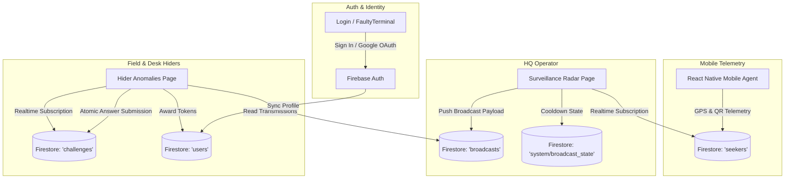

# OpenVerse: Solve & Seek (Hide & Seek Tactical Grid)

Tactical Campus Surveillance Command Center & Competitive Hider Challenge Matrix built for real-world campus-scale alternate reality gaming (ARG) / Capture The Flag (CTF) at **IIIT Kottayam**.

---

## 1. Executive Summary & Vision

**OpenVerse // Solve & Seek** is an integrated real-time tactical operations platform designed for large-scale outdoor campus hide-and-seek and cyber-physical challenges. The system bridges mobile field agents (Seekers) and stationary operatives (Hiders & Command Control) through a unified tactical web interface backed by **Google Cloud Firestore** and **Firebase Authentication**.

### Core Pillars
1. **Tactical Surveillance Radar**: Real-time Leaflet GIS tracking of field seekers across IIIT Kottayam's physical zones (Academic Blocks, Admin, OAT, Dining, Sports Ground) with normalized coordinate projection and telemetry feeds.
2. **Periodic Transmission Intel Protocol**: A 10-minute synchronized broadcast window allowing command operators to push seeker location snapshots to field hiders, managed with monotonic server-time verification.
3. **Competitive Anomaly Challenge Matrix**: A shared puzzle pool across Cryptography, Network, Linux, Logic, OSINT, and Campus intelligence with **atomic first-solve lockout** in Firestore to reward speed and eliminate duplicate token claims.
4. **Cyber-Tactical Aesthetic**: High-performance CRT/WebGL visual design powered by `ogl` shaders, Framer Motion, and Tailwind CSS.

---

## 2. Technology Stack

| Layer | Technologies | Details |
| :--- | :--- | :--- |
| **Frontend Core** | React 19, TypeScript (~6.0), Vite 8 | Ultra-fast HMR, Strict Type Checking |
| **State Management** | Zustand 5 | Decoupled modular stores (`authStore`, `surveillanceStore`, `hiderStore`) |
| **Styling & Design** | Tailwind CSS 3.4, PostCSS, Framer Motion 13 | Neon cyber aesthetics, scanline shaders, smooth spring transitions |
| **WebGL & Shaders** | OGL 1.0 | Interactive GPU `FaultyTerminal` background on authentication portal |
| **Geospatial & Maps** | Leaflet 1.9, CartoDB Dark Matter, Esri Satellite | Custom polygon layers, radar markers, GPS-to-grid normalization |
| **Backend & Database**| Firebase Auth, Cloud Firestore (Web SDK v12) | Real-time `onSnapshot` listeners, atomic `runTransaction` |
| **Code Quality** | Oxlint 1.79, TypeScript Compiler (`tsc -b`) | Zero-latency linting and type assertion |

---

## 3. System Architecture & Workflows

### 3.1 Architecture Overview



---

## 4. Key Functional Modules

### 4.1 Authentication & Security (`/login`)
- **Dual Authentication Modes**: Supports email/password authentication as well as one-click Google OAuth.
- **Interactive WebGL Terminal**: High-fidelity CRT monitor shader (`FaultyTerminal.tsx`) reacting to cursor movement and time distortion.
- **Synchronous Session Hydration**: Synchronizes auth status immediately with local caching to prevent UI flicker on page reload.
- **Route Protectors**: `RequireAuth` and `RedirectIfAuthed` guards enforce strict role clearance. Only users assigned `role = "hider"` in the database schema are permitted entry; any other role triggers an immediate 403 Forbidden security lockout screen.

### 4.2 Tactical Surveillance HQ (`/surveillance`)
- **GIS Leaflet Map Engine**:
  - Centered on IIIT Kottayam coordinates (`9.75495, 76.64995`).
  - Renders official OpenStreetMap polygons for **Academic Block 1 & 2**, **Admin Block**, **Open Area Theatre (OAT)**, **Dining Hall & Cafeteria**, **Fitness Centre**, and **Sports Grounds**.
  - Dual map layers: **Tactical CartoDB Dark Matter** (high-contrast neon) and **Esri World Imagery** (satellite reconnaissance).
- **Seeker Telemetry Drawer**:
  - Live indicator of active mobile seeker nodes, battery percentages, connection signal strengths, travel speeds, and last ping timestamps.
  - Tracking of collected campus QR artifacts (15 artifacts total).
  - Quick-add node simulator for field testing without physical mobile clients.
- **Periodic Transmission Protocol (`SharePositionsControl`)**:
  - 10-minute tactical broadcast cycle enforced by server-synchronized timestamps (`serverTime.ts`).
  - Broadcasts active seeker positions across campus zones to the `broadcasts` Firestore collection.
  - Historical broadcast inspection log.

### 4.3 Hider Anomaly Grid (`/hider`)
- **Competitive Shared Puzzle Matrix**:
  - Categories: `CRYPTOGRAPHY`, `NETWORK`, `LOGIC`, `LINUX`, `OSINT`, and `CAMPUS`.
  - Difficulty tiers: `EASY` (50 pts, 1 token), `MEDIUM` (100 pts, 1 token), `HARD` (200 pts, 2 tokens).
- **First-Solve Lockout System**:
  - Backed by Firestore `runTransaction` to prevent race conditions.
  - If two operatives submit simultaneously, the server awards points and tokens only to the first verified commit; subsequent attempts receive an instantaneous `CHALLENGE_ALREADY_CLAIMED` lockout notification displaying the winner's callsign.
- **Interactive Cyber Terminal Modal**:
  - Simulated command terminal interface with syntax hints, auto-focused inputs, multi-format answer verification (case/whitespace normalization and pipe-delimited answers), and failure feedback.
- **HUD & Status Filtering**:
  - Quick filters: `ALL`, `OPEN`, `CLAIMED BY OTHERS`, `SOLVED BY ME`.
  - Real-time token counter reflecting earned elimination tokens.

---

## 5. Cloud Firestore Data Schema

### 5.1 Collection: `users`
Represents verified operative identities. In the database schema, all authorized operatives are assigned `role = "hider"`. Operatives without `role = "hider"` are strictly locked out of the application.
```typescript
interface UserProfile {
  id: string;                  // Firebase Auth UID
  email: string;               // Registered operative email
  playerId: string;            // Callsign (e.g., 'HDR-E12F')
  username: string;            // Display name
  role: 'hider' | 'HIDER';     // Strictly required for app access
  status: 'ACTIVE' | 'ELIMINATED';
  eliminationTokens: number;   // Balance earned from solved challenges
  createdAt: string;           // ISO 8601 string
}
```

### 5.2 Collection: `seekers`
Represents real-time telemetry from mobile seekers.
```typescript
interface SeekerTelemetry {
  id: string;                  // Document ID
  playerId: string;            // e.g., 'S-001'
  name: string;                // Field callsign (e.g., 'Echo Agent')
  zoneId: string;              // e.g., 'academic_1'
  zoneName: string;            // e.g., 'Academic Block 1'
  x: number;                   // Normalized X coordinate (0 - 1000)
  y: number;                   // Normalized Y coordinate (0 - 750)
  lat?: number;                // GPS Latitude
  lon?: number;                // GPS Longitude
  battery: number;             // Battery percentage (0 - 100)
  signal: 'STRONG' | 'GOOD' | 'WEAK';
  status: 'ACTIVE' | 'CLAIMING_ARTIFACT' | 'IN_TRANSIT';
  speedKmh?: number;
  qrScannedCount?: number;     // Valid artifacts claimed (0 - 15)
  lastPing: number;            // Epoch milliseconds
}
```

### 5.3 Collection: `challenges`
Competitive puzzle pool for hiders.
```typescript
interface ChallengeDocument {
  id: string;                  // e.g., 'ch-01'
  title: string;               // e.g., 'ANOMALY_01: Packet Intercept'
  description: string;         // Markdown description
  category: 'CRYPTOGRAPHY' | 'NETWORK' | 'LOGIC' | 'LINUX' | 'OSINT' | 'CAMPUS';
  difficulty: 'EASY' | 'MEDIUM' | 'HARD';
  points: number;              // Score points (50, 100, 200)
  tokensAwarded: number;       // Tokens rewarded (1, 2)
  answer: string;              // Normalized answer or pipe-separated options
  hints: string[];             // Array of hint strings
  isSolved: boolean;           // True once claimed
  solvedBy: {
    uid: string;
    playerId: string;
    username: string;
  } | null;
  solvedAt: number | null;     // Epoch milliseconds
  order: number;               // Ordering index
}
```

### 5.4 Collection: `broadcasts`
Historical transmissions released to hiders.
```typescript
interface BroadcastDocument {
  id: string;                  // e.g., 'bc-1711234567890'
  timestamp: Timestamp;        // Firestore serverTimestamp
  serverEpochMs: number;       // Monotonic reference time
  operator: string;            // Broadcaster callsign
  totalActiveSeekers: number;  // Count of tracked seekers
  seekerPositions: {
    playerId: string;
    name: string;
    zoneName: string;
    x: number;
    y: number;
  }[];
}
```

---

## 6. Directory Structure

```
hidenseek/
├── public/                       # Static public assets
├── src/
│   ├── assets/                   # Vector graphics and icons
│   ├── components/
│   │   ├── hider/                # Hider Anomaly Grid UI
│   │   │   ├── ChallengeCard.tsx           # Individual anomaly card with status indicators
│   │   │   ├── ChallengeTerminalModal.tsx  # Cyber modal terminal with answer submission
│   │   │   └── HiderHUD.tsx                # Status banner, token count & filter controls
│   │   ├── layout/               # High-level shell & backgrounds
│   │   │   └── GameLayout.tsx              # Scanline overlay & base container
│   │   ├── surveillance/         # Radar & Telemetry UI
│   │   │   ├── SeekerTelemetryDrawer.tsx   # Live seeker telemetry & node manager
│   │   │   ├── SharePositionsControl.tsx   # 10-min broadcast cooldown timer
│   │   │   └── SurveillanceMap.tsx         # Leaflet tactical radar with zone polygons
│   │   └── ui/                   # Reusable shader & primitive UI
│   │       ├── FaultyTerminal.css          # Fullscreen canvas styling
│   │       └── FaultyTerminal.tsx          # OGL WebGL CRT shader component
│   ├── lib/                      # Core services & utilities
│   │   ├── firebase.ts           # Firebase SDK initialization & Firestore transactions
│   │   ├── gameService.ts        # Business logic bridging stores to Firebase
│   │   ├── iiitkCampusData.ts    # OSM geographic polygons & coordinate normalization
│   │   └── serverTime.ts         # Clock skew sync with monotonic time tracking
│   ├── pages/                    # Primary application views
│   │   ├── Hider.tsx             # Hider Anomaly Matrix route (/hider)
│   │   ├── Login.tsx             # Cyberpunk authentication portal (/login)
│   │   └── Surveillance.tsx      # Command Radar Dashboard (/surveillance, /)
│   ├── store/                    # Zustand state management
│   │   ├── authStore.ts          # Auth state, session sync & profile management
│   │   ├── hiderStore.ts         # Challenge pool, filters & atomic submission state
│   │   └── surveillanceStore.ts  # Seeker nodes, map selection & broadcast cooldown
│   ├── types/                    # Shared TypeScript domain contracts
│   │   └── game.ts               # Interfaces for Seeker, Challenge, Profile, Broadcast
│   ├── utils/                    # Helper functions
│   │   └── cn.ts                 # Classname merge utility (clsx + twMerge)
│   ├── App.tsx                   # Top-level routing and authentication guards
│   ├── index.css                 # Global cyber styles, scrollbars, fonts
│   └── main.tsx                  # Application mount point
├── .env.example                  # Environment variable reference
├── .env.local                    # Local development configuration
├── DEADCODE.md                   # Audit log of cleaned legacy modules
├── package.json                  # Dependencies and execution scripts
├── tailwind.config.js            # Color schemes, fonts, keyframe animations
└── vite.config.ts                # Vite build configuration
```

---

## 7. Setup & Development Guide

### 7.1 Prerequisites
- **Node.js**: v18.0.0 or higher
- **npm** or **pnpm**
- Modern WebGL2-compatible browser (Chrome, Firefox, Safari, Edge)

### 7.2 Installation
```bash
# Clone the repository
git clone <repo-url>
cd hidenseek

# Install dependencies
npm install
```

### 7.3 Environment Configuration
Create a `.env.local` file in the project root:
```env
# CARTO Basemaps API Key (Optional for tactical dark tiles)
VITE_CARTO_API_KEY=your_carto_api_key_here
```
*(Firebase configuration is pre-wired to the active production project `cmiyc-d170c` inside `src/lib/firebase.ts`)*.

### 7.4 Running the Application
```bash
# Start the local development server (Vite HMR)
npm run dev

# Run TypeScript typecheck and linting
npm run test

# Build for production
npm run build

# Preview production build locally
npm run preview
```

---

## 8. Tactical Coordinates & Campus Zones

Geographic coordinates defined in `src/lib/iiitkCampusData.ts` are calibrated to the **Indian Institute of Information Technology Kottayam (Valavoor, Pala, Kerala)**:

| Facility Name | Category | Primary Coordinates | Zone Key |
| :--- | :--- | :--- | :--- |
| **Academic Block 1** | Academic & Admin | `9.754904, 76.649988` | `academic_1` |
| **Academic Block 2** | Academic & Admin | `9.755232, 76.648973` | `academic_2` |
| **Admin Block** | Academic & Admin | `9.754938, 76.649575` | `admin` |
| **Open Area Theatre (OAT)** | Academic & Admin | `9.755043, 76.650634` | `oat` |
| **Dining Hall & Cafeteria** | Dining & Amenities | `9.755678, 76.650101` | `dining` |
| **Fitness Centre / Gym** | Dining & Amenities | `9.755684, 76.649227` | `fitness` |
| **Main Sports Ground** | Sports Ground | `9.754000, 76.649392` | `sports_ground` |
| **Volleyball Ground** | Sports Ground | `9.754986, 76.651298` | `volleyball` |

*Note: Student hostels are restricted and intentionally excluded from the tactical playable area.*

---

## 9. Recent Milestones & Changelog

- **Dead Code Purge**: Audited and eliminated legacy Supabase endpoints, unreferenced WebGL grids, and mock CTF files (`-1,900+` lines of dead code removed; see `DEADCODE.md`).
- **Real-Time First-Solve Lockout**: Deployed atomic Firestore transactions in `submitChallengeAnswerAtomic` with instant cross-client synchronization.
- **Leaflet Radar Integration**: Configured interactive geospatial polygons for IIIT Kottayam with tactical dark and satellite tile switching.
- **Cyber-Tactical HUD**: Integrated live seeker battery telemetry, QR artifact scan counters, and WebGL terminal shaders.
